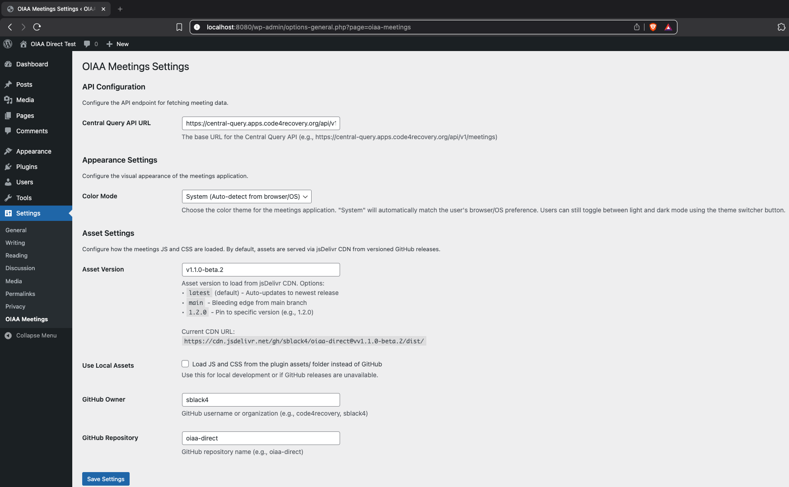

# WordPress Plugin

The OIAA Meetings WordPress plugin renders the meeting list app at a configurable WordPress base path (for example, `/meetings`) using `template_redirect`. The app's JS/CSS can be loaded from jsDelivr CDN or from local plugin assets.

## How It Works

```
Developer commits code → builds dist/ → tags a release
                                           ↓
                              jsDelivr CDN serves dist/ files at that tag
                                           ↓
                              WordPress plugin loads JS/CSS from CDN
```

1. The app is built with `npm run build:wordpress` which outputs `dist/oiaa-meetings.js` and `dist/oiaa-meetings.css`.
2. Built files in `dist/` are committed to the repo.
3. A GitHub release is tagged (e.g. `v1.2.0`).
4. [jsDelivr](https://www.jsdelivr.com/) automatically serves repo files at that tag:
   `https://cdn.jsdelivr.net/gh/code4recovery/oiaa-direct@v1.2.0/dist/oiaa-meetings.js`
5. The WordPress plugin constructs this URL using the **Asset Version** setting and loads the script.

This is the same pattern used by [tsml-ui](https://github.com/code4recovery/tsml-ui).

## Installation

1. Download the latest `.zip` from [GitHub Releases](https://github.com/code4recovery/oiaa-direct/releases).
2. In WordPress, go to **Plugins → Add New → Upload Plugin** and upload the zip.
3. Activate the plugin.
4. Configure **Base Path** (for example `/meetings`) and ensure a matching page exists.

## Settings

Go to **Settings → OIAA Meetings** in the WordPress admin.

| Setting | Default | Description |
|---------|---------|-------------|
| Central Query API URL | `https://central-query.apps.code4recovery.org/api/v1/meetings` | API endpoint the app fetches meeting data from |
| Color Mode | `system` | `light`, `dark`, or `system` (users can still toggle in the app UI) |
| Asset Version | `latest` | Which release to load from the CDN (see below) |
| Use Local Assets | off | Load JS/CSS from the plugin directory instead of the CDN |
| GitHub Owner | `code4recovery` | GitHub org/user for the CDN URL |
| GitHub Repo | `oiaa-direct` | GitHub repo name for the CDN URL |

### Asset Version options

- **`latest`** — always serves the most recent default branch. Auto-updates but may include unreleased changes.
- **`main`** — same as latest for this repo (main is the default branch).
- **`1.2.0`** (semver) — pinned to a specific release tag. The plugin adds the `v` prefix automatically (`@v1.2.0`). This is the recommended approach for production sites.

The settings page shows a live preview of the resulting CDN URL.

<!-- TODO: add screenshot of settings page -->

## Updating the App

When a new release is published:

1. No plugin update needed.
2. Go to **Settings → OIAA Meetings**.
3. Change **Asset Version** to the new version number (e.g. `1.3.0`).
4. Save. The site now loads the new JS/CSS from the CDN.

Sites using `latest` pick up changes automatically. The release workflow purges the jsDelivr cache so updates propagate within minutes. If needed, you can also purge manually via the [jsDelivr purge tool](https://www.jsdelivr.com/tools/purge).



## Troubleshooting

| Problem | Fix |
|---------|-----|
| Blank meeting list after version change | The version probably doesn't match a tag. Verify the URL works: `https://cdn.jsdelivr.net/gh/code4recovery/oiaa-direct@v{version}/dist/oiaa-meetings.js` |
| Need to roll back | Set Asset Version back to the previous value |
| Behind a firewall / working offline | Enable **Use Local Assets** (the plugin zip must include built files in `assets/`) |
| Styles look wrong | Check that no theme CSS is overriding the plugin styles. The plugin loads `wordpress-overrides.css` to handle common conflicts |

## For Developers

### Building the plugin

```bash
npm run build:wordpress-plugin
```

This runs the Vite build, copies assets into the plugin directory, and creates `dist/oiaa-meetings-wordpress-plugin-v{version}.zip`.
The assets in `dist/` are what get served to the wordpress plugin through jsDelivr.

### Release workflow

The GitHub Actions workflow (`.github/workflows/build-wordpress-plugin.yml`) triggers on:
- **Release published** — builds the plugin, attaches the `.zip` to the release, and purges the jsDelivr `@latest` cache
- **Manual dispatch** — for ad-hoc builds

To cut a release:

```bash
npm run build:wordpress
git add dist/
git commit -m "build: update dist for v1.2.0"
git tag v1.2.0
git push origin main --tags
```

Then create a GitHub release from the tag. The workflow builds and attaches the plugin zip automatically.

Then update the `Asset Version` on the settings page to `1.2.0` to use that code.
